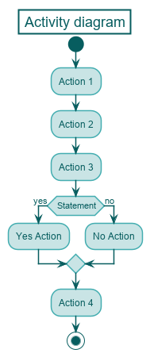
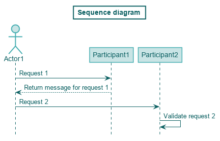

# PlantUML Stylesheet
Universal stylesheet for PlantUML

# How to use it
## Use a local copy
- Download the design.puml
- In your PlantUML code include the following `!include {PATH_TO_design.puml}`
- replace {PATH_TO_design.puml} with the path to the design.puml file

example:

    @startuml

    !include style/design.puml

    Title My Activity diagram
    -- Rest of the PlantUML code --

## Use as remote content
Instead of downloading the stylesheet and using a local copy, you can use a remote copy. This can be done by including the following line in your PlantUML code:
`!includeurl https://raw.githubusercontent.com/idsvanderzee/PlantUMLISStijl/master/design.puml`

# Overriding styles
All the styling included in the stylesheet can be easily overridden by including other styling in your in PlantUML code.

# Examples
### Activity diagram

### Sequence diagram

